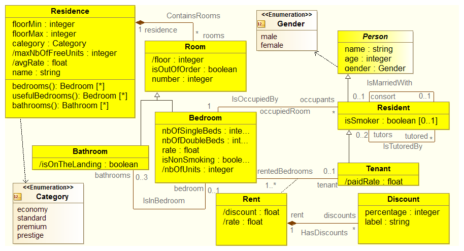
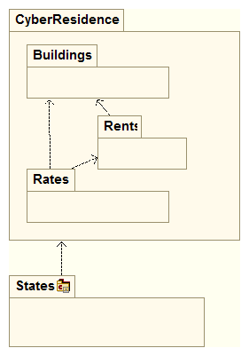
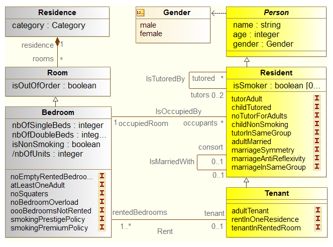
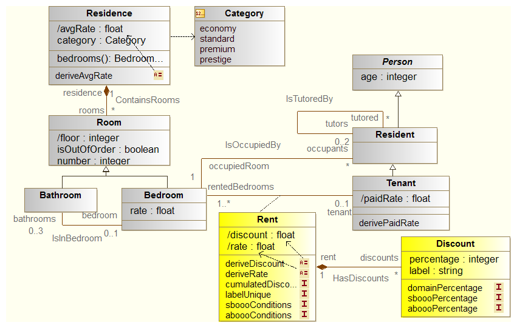

CyberResidencesOCL
==================

This case study provides a UML model dealing with long-stay "*Residences*" such
as university residences or so. The *model* represented by various class
*diagrams*. Each diagram is providing information about the CyberResidence
*system* and according to a different perspective.

Overview
--------
The diagram below presents CyberResidences from a global perspective.
This diagram does not show however the constraints. These constraints, or
at least their location, will be presented in the context of each package.

In fact, the UML model has been split logically in three different packages:
* Buildings_ package
* Rents_ package
* Rates_ package

The diagram below shows the decomposition of the system in subsystems.
Additionally the package 'States' contains examples of states for illustrating
and or testing CyberResidences.

Each package is described below separately.

.. _Buildings:

"Buildings" package
-------------------
The "Buildings" package describes residences from a rather physical
perspective. Residences are made of rooms that are either bedrooms or
bathrooms. This diagram shows not only these concepts but also lists
the constraints associated with each class.

.. figure:: media/Buildings_Constraints.png
    :align: center

.. _Rents:

"Rents" package
---------------
The "Rents" package is basically answering "who is in the residence". A tenant
pay for one or more rooms, but he or she may be responsible of a much larger
group of residents. These residents all occupy a room rented from that tenant.
This diagram shows not only these concepts but also lists the constraints
associated with each class. The "Rents" package heavily depends on the
Buildings_.

.. _Rates:

"Rates" package
---------------
The "Rates" package is basically answering "how much are rents?". It is all
about money, rates and discounts. The rate for a rent depends on various
factors but in particular on the category of the residence. This package
depends on the Rents_ and on the Buildings_.

Constraints
-----------
The constraints on the model are written in natural language. Each constraint
has a given name. There are about 40 constraints in the model.

.. .... tabularcolumns:: |C|C|

.. list-table:: Examples of constraints
    :widths: 15, 85
    :header-rows: 1
    :stub-columns: 1

    *
        * Name
        * Description
    *
        * adultMarried
        * To be registered as married, resident must be adult.

    *
        * childTutored
        * Resident that are less than 18 years old must have at least one
          tutor, apart in prestige residences where this rule does not
          apply.

The goal is to convert to express these constraints in a an operation model,
namely using the OCL language.

USE OCL Specification
---------------------

The `USE OCL`_ tool allows to express a full specification. Such a
textual specification contains in a same file:

* the structural specification.
    This is the equivalent of class diagrams but expressed using a simple
    textual notation. Instead of written ``A`` in a box as in a UML class
    diagram, one write ``class A``. You can see below the class ``Residence``
    translated in USE OCL::

                class Residence
                attributes
                    name     : String
                    floorMin : Integer
                    floorMax : Integer
                    category : Category
                    maxNbOfFreeUnits : Integer -- @derived
                    avgRate : Real             -- @derived
                end

* the constraint specifications.
    All the constraints can then be written in a dialect of OCL. Only a
    few keywords change with respect to OCL.

.. note::

    The details of the USE OCL language can be found in the
    `USE OCL documentation`_ and in the particular in the reference manual.

.. attention::

    TODO

Tests
-----

.. attention::

    TODO
    @assert directive

.. ............................................................................

.. _`USE OCL`: http://scribetools.readthedocs.org/en/latest/useocl
.. _`USE OCL documentation`: http://scribetools.readthedocs.org/en/latest/useocl/#documentation
